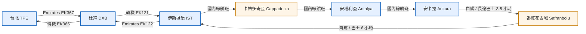

🇹🇷 **土耳其 9天8夜自由行行程表（含 Emirates 航班）**

📅 旅遊日期：2026/09/25 – 2026/10/03  
👥 人數：2人  
✈️ 航班：Emirates 阿聯酋航空（台北TPE → 杜拜DXB → 伊斯坦堡IST / 伊斯坦堡IST → 杜拜DXB → 台北TPE）

---

## ✈️ 航班資訊
- **去程**：2026/09/25（五）  
  - 台北 TPE  → 杜拜 DXB → 伊斯坦堡 IST  
  - 飛行約 15–17 小時（含轉機）  
  - 建議選擇轉機時間 2–4 小時的班次。

- **回程**：2026/10/03（六）  
  - 伊斯坦堡 IST → 杜拜 DXB → 台北 TPE  
  - 飛行約 14–16 小時  
  - 當天出發，隔日抵台（10/04）。

---

## 🗓 詳細行程表

### Day 1｜9/25（五）— 台北 ✈️ 杜拜 ✈️ 伊斯坦堡
- 搭乘 Emirates 阿聯酋航空航班前往杜拜轉機，轉飛伊斯坦堡。
- 建議抵達伊斯坦堡當晚入住舊城區飯店休息。
- 🏨 住宿：伊斯坦堡 Sultanahmet 區飯店

---

### Day 2｜9/26（六）— 伊斯坦堡文化日
- 參觀藍色清真寺、聖索菲亞大教堂、托普卡匹皇宮。
- 下午逛加拉太塔、塔克辛廣場、博斯普魯斯海峽遊船。
- 🏨 住宿：伊斯坦堡

---

### Day 3｜9/27（日）— 伊斯坦堡 ✈️ 卡帕多奇亞（Cappadocia）
- 早班機飛往開塞利/內夫謝希爾（約1.5小時）。
- 抵達後前往 Göreme 鎮，參觀露天博物館與烏奇希薩城堡。
- 🏨 住宿：洞穴飯店（Göreme Cave Hotel）

---

### Day 4｜9/28（一）— 卡帕多奇亞熱氣球奇幻日
- 清晨搭乘熱氣球觀賞日出（提前預約）。
- 白天遊覽：愛情谷、精靈煙囪、地下城、陶藝村。
- 🏨 住宿：Göreme

---

### Day 5｜9/29（二）— 卡帕多奇亞 ✈️ 安塔利亞（Antalya）
- 早班機飛往地中海城市安塔利亞（約1小時）。
- 下午漫步舊城區 Kaleiçi，參觀哈德良門與老港口。
- 晚餐享用地中海海鮮。
- 🏨 住宿：安塔利亞舊城區飯店

---

### Day 6｜9/30（三）— 地中海度假日
- 路線建議：
  1️⃣ Konyaaltı 海灘放鬆＋水族館  
  2️⃣ Düden 瀑布＋Aspendos 羅馬劇場  
  3️⃣ 自駕前往 Kas 或 Kemer 小鎮度假
- 🏨 住宿：安塔利亞

---

### Day 7｜10/01（四）— 安塔利亞 ✈️ 安卡拉 🚗 番紅花古城
- 早班機飛往安卡拉（約1小時），再租車/巴士前往番紅花古城（約3.5小時）。
- 抵達後入住傳統木屋旅館。
- 🏨 住宿：Safranbolu 古城木屋旅館

---

### Day 8｜10/02（五）— 番紅花古城 → 伊斯坦堡
- 上午漫步古鎮：Hidirlik Hill、Cinci Han、老市集。
- 下午返回伊斯坦堡（約6小時車程）。
- 傍晚抵達，準備回程。
- 🏨 住宿：伊斯坦堡機場飯店

---

### Day 9｜10/03（六）— 伊斯坦堡 ✈️ 杜拜 ✈️ 台北
- 早餐後前往伊斯坦堡機場，搭乘 Emirates 航班返台。
- ✈️ 伊斯坦堡 → 杜拜 → 台北
- 於 10/04（日）抵達台灣。

---

## 💰 預算總表（2人）
| 項目 | 金額 (TWD) | 備註 |
|------|-------------|------|
| **國際機票（Emirates）** | **57,380** | NT$28,690 × 2 人 |
| **國內航班（3段）** | 16,000 | 伊斯坦堡 → 卡帕多奇亞 → 安塔利亞 → 安卡拉 |
| **住宿（8晚）** | 40,000 | 四星＋洞穴＋海景飯店 |
| **熱氣球＋活動** | 15,000 | 含卡帕多奇亞熱氣球 |
| **餐飲＋交通＋門票** | 25,000 | 平均每日約 3,000 |
| **總計** | 💰 **約 NT$153,000（兩人）** | 約 NT$76,500 / 人 |

---

## 🗺 旅程路線圖（簡略）
TPE ✈️ DXB ✈️ IST → Cappadocia ✈️ Antalya ✈️ Ankara 🚗 Safranbolu 🚗 IST ✈️ DXB ✈️ TPE

---

✨ **特色總覽**
- 🎈 熱氣球：卡帕多奇亞清晨日出體驗
- 🏝 地中海：安塔利亞湛藍海岸
- 🏡 番紅花古城：歐式木屋童話鎮
- 🕌 伊斯坦堡：文化、清真寺、皇宮與海峽夜景

---

📌 建議攜帶：薄外套、防曬乳、行動電源、轉接頭（Type F）、國際信用卡（支援 Visa/Master）

🧭 建議保險：海外旅遊保險（含航班延誤與行李遺失）

---

© Kenny Lin 旅行企劃 — 土耳其 9天8夜行程表 2026

---

